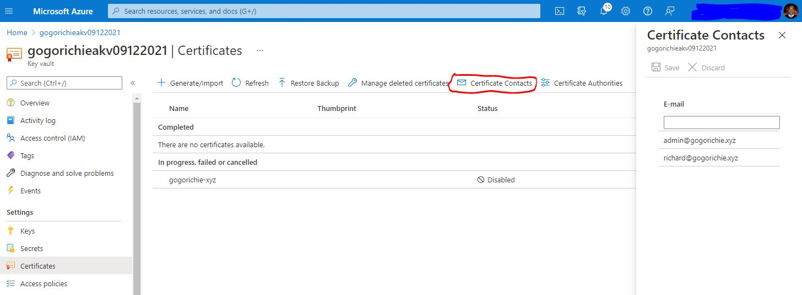
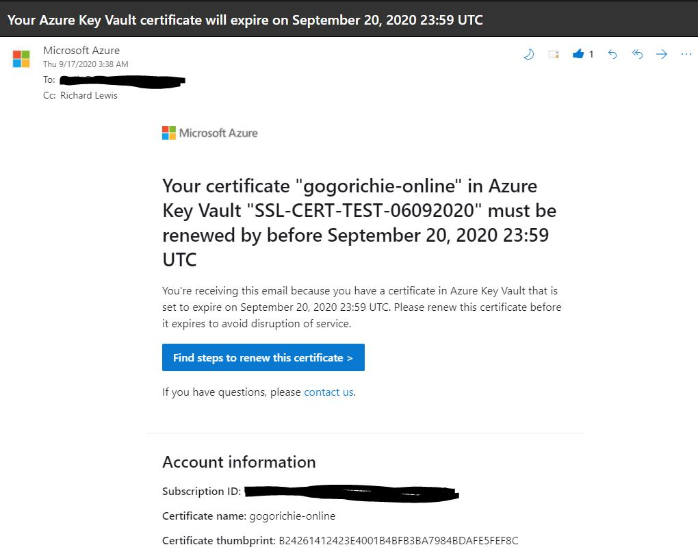

Back in July fellow Azure blogger [Billy York](https://twitter.com/SCAutomation) wrote a [blog post](https://www.cloudsma.com/2021/07/monitor-ssl-cert-Azure-monitor/) about Monitoring SSL certificates with Azure monitor utilizing a standard test within App Insights, it's really cool that Azure finally added this ability. I want to talk about an alternative less known method using Azure Key Vault certificate contacts and lifetime contacts.

**What is Azure Key Vault?**

For those who are unfamiliar with The Azure service Azure Key Vault the fastest way to sum it up is that its a cloud service on Azure used for storing sensitive application information like tokens, passwords, API keys as well as TLS and SSL certificates used by resources on Azure or accessing Azure resources. The benefit of using a service like this is it will greatly reduce the risk of secrets being leaked accidentally. If you would like a more comprehensive overview of the service go to the [Azure Key Vault website](https://docs.microsoft.com/en-us/Azure/key-vault/general/).

**How To Monitor Certificates**

Ok so let’s say you’re storing your SSL certificates in a Azure Key Vault and you want a way to monitor the certificates expiration dates without having to use an additional service such as App Insights.

Assuming that you have a Key Vault created with ceritficates already stored within the vault. Start clicking on certificate contacts and ensure that this area is populated with the contacts of who to notify when certificates are expiring.

Next let’s update the issuance policy for the certificate. Begin by clicking on the SSL certificate and within the certificate versions click on issuance policy. This will take you to the issuance policy for the certificate version you're looking to update.

Within the Lifetime Actions Type you can set the action to take as the certificate ages as well as Number of Days prior to expiration before the notification is to be sent.

When the number of days before expiration of the certifcate an email notification will be sent to the to the certfcate contacts like the one listed below.

